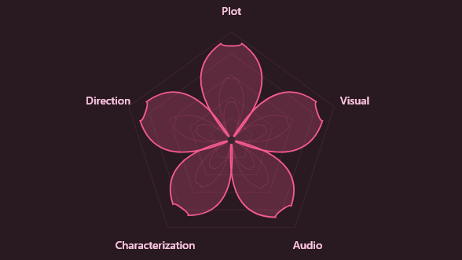

# RadarAni — レーダアニ
### *Multidimensional Anime Rating Platform*

<div align="center">
  
  <br/><br/>

  
  
  
  

</div>

---

## 🌸 Tentang RadarAni

**RadarAni** adalah aplikasi desktop penilaian anime multidimensi yang dirancang untuk melampaui keterbatasan sistem skor tunggal pada platform seperti MyAnimeList. Alih-alih meringkas kualitas sebuah anime ke dalam satu angka, RadarAni memungkinkan pengguna mengevaluasi karya animasi dari **5 dimensi krusial** secara terpisah dan terstruktur.

> *"Sebuah anime dengan visual memukau namun cerita lemah mungkin mendapat skor akhir yang sama dengan karya yang ceritanya brilian namun animasinya di bawah standar — RadarAni hadir untuk membedakan keduanya."*

---

## 🎯 Latar Belakang

Komunitas anime global terus berkembang pesat. Per 2023, platform MyAnimeList saja telah mencatat lebih dari 23.000 entri anime dengan ~69,4 juta kunjungan bulanan. Namun di balik besarnya komunitas ini, sistem penilaian berbasis **skor agregat tunggal** memiliki kelemahan mendasar:

- Menyembunyikan **polarisasi pendapat** dan *recency bias*
- Tidak mampu merepresentasikan **preferensi spesifik** pengguna (misalnya: penonton yang memprioritaskan cerita vs. yang mengutamakan visual)
- Rentan terhadap **Halo Effect** — satu aspek yang menonjol menutupi kelemahan aspek lain
- Menciptakan anomali peringkat, seperti judul yang sangat disukai fans namun berada di peringkat rendah secara resmi

RadarAni hadir sebagai solusi dengan paradigma penilaian yang **terurai dan transparan**.

---

## ✨ Fitur Utama

| Fitur | Deskripsi |
|---|---|
| 🕸🌸 **Radar Chart Rating** | Visualisasi 5 dimensi penilaian dalam bentuk grafik jaring laba-laba |
| 🔍 **Live Anime Scraper** | Tambah anime baru langsung dari MyAnimeList via judul atau URL |
| 📊 **Analytics Dashboard** | Visualisasi data mendalam: bar chart, donut chart, network graph, KDE plot, bubble chart |
| 🎌 **Katalog Interaktif** | Jelajahi 500+ anime dengan filter, pencarian, dan pengurutan dinamis |
| 👤 **Profil Personal** | Statistik selera pengguna berdasarkan riwayat penilaian |
| 🎨 **8 Pilihan Tema** | Light (Sakura, Matcha, Pastel, Ocean) & Dark (Dark, Aurora, Cyber, Dusk) |
| 💾 **Local Storage** | Data tersimpan lokal dalam format JSON — tidak memerlukan koneksi server |

---

## 📐 5 Dimensi Penilaian

RadarAni memecah penilaian anime ke dalam lima aspek yang berlandaskan teori analisis film dan media (Kajian Sinema):

<div align="center">
  
  <br/><br/>


</div>

| Dimensi | Deskripsi |
|---|---|
| **Plot** | Kualitas alur cerita, struktur naratif, dan konsistensi |
| **Visual** | Kualitas animasi, komposisi visual, dan estetika gambar |
| **Audio** | Soundtrack, efek suara, dan performa pengisi suara |
| **Characterization** | Kedalaman, perkembangan, dan kredibilitas karakter |
| **Direction** | Penyutradaraan, ritme penceritaan, dan pengelolaan emosi |

---

## 🛠️ Teknologi

- **Bahasa Utama:** Python 3.9+
- **UI Framework:** [Flet](https://flet.dev/) — berbasis Flutter
- **Visualisasi:** Flet Canvas (Radar Chart, Bar Chart, Network Graph, Bubble Chart, KDE Plot)
- **Data Scraping:** BeautifulSoup4, Requests
- **Penyimpanan:** JSON (local file storage)
- **Sumber Data:** MyAnimeList dan AniList

---

## 📦 Dataset

Aplikasi ini dilengkapi dengan data awal yang dikumpulkan melalui web scraping:

- 🎬 **500+ judul anime** dari MyAnimeList & AniList (termasuk metadata lengkap, cover, dan banner)
- 👥 **80 profil pengguna** dengan riwayat penilaian multidimensi yang direkayasa dari data MAL
- ⭐ **15.000+ data rating** tersebar di seluruh dimensi penilaian

---

## 🚀 Panduan Instalasi & Penggunaan Scraper

### 1. Prasyarat
- Python 3.9 atau versi yang lebih baru terinstal di sistem Anda.
- Git (opsional, jika memilih opsi clone).

### 2. Dapatkan Projek
Anda bisa mengunduh projek ini dengan *clone* repositori atau mengunduh file ZIP:
**Opsi A: Clone via Git**
```bash
git clone <https://github.com/rusdysetiyo/D1_RadarAni.git>
cd RadarAni
```
**Opsi B: Unduh ZIP**
Unduh repositori sebagai file `.zip`, ekstrak, dan buka terminal/Command Prompt tepat di dalam direktori folder yang telah diekstrak.

### 3. Setup Virtual Environment (VENV)
Buat dan aktifkan *virtual environment* untuk menghindari konflik versi antar library:
**Windows:**
```bash
python -m venv venv
venv\Scripts\activate
```
**Mac/Linux:**
```bash
python3 -m venv venv
source venv/bin/activate
```

### 4. Install Dependensi
Jalankan perintah berikut untuk mengunduh semua *requirements*:
```bash
pip install -r requirements.txt
```

### 5. Menjalankan Scraper
Pastikan path terminal Anda berada di *root* direktori projek (bukan masuk ke dalam folder `scripts`).

#### A. Memulai Sesi Scraping Baru
Saat memulai sesi baru, 3 parameter berikut **wajib** disematkan:
```bash
python scripts/scraper.py --pages 10 --top tv --file data_anime_tv
```
**Daftar Parameter:**
- `--pages`: Jumlah halaman yang ingin discrape (1 halaman = 50 anime).
- `--top`: Tipe top anime yang ingin ditarik. Pilihan valid: `rated`, `airing`, `tv`, `movie`, `ova`, `ona`, `special`, `popular`, `favorite`.
- `--file`: Nama file JSON sebagai tempat penyimpanan akhir dan checkpoint.

#### B. Melanjutkan Sesi (Continue)
Jika proses terhenti di tengah jalan (misal dihentikan manual dengan `Ctrl+C` atau jaringan terputus), progres akan otomatis tersimpan. Untuk melanjutkannya, cukup gunakan perintah `--continue` diikuti dengan nama file sesi sebelumnya:
```bash
python scripts/scraper.py --continue data_anime_tv
```
*(Catatan: Semua sisa halaman, URL kategori, dan progres akan dilanjutkan secara otomatis tanpa perlu mengisi kembali `--pages`, `--top`, dan `--file`.)*

---

## 👥 Tim Pengembang

- **M. Ramadhan Kurniawan - 251524111**
- **Muhammad Rifki Aunur Rahman - 251524116**
- **Rusdya Setiyo Aji - 251524122**
- **Syadida Tsaqifa Nada - 251524123**

Proyek ini dikembangkan sebagai **Tugas Besar** mata kuliah rekayasa perangkat lunak.

---

<div align="center">
  <sub>Made with 🌸 by the RadarAni Team</sub>
</div>
